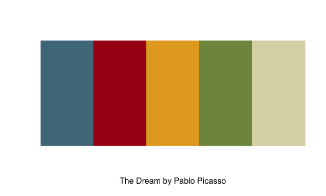
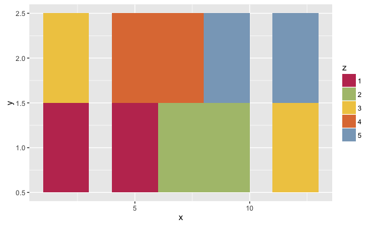
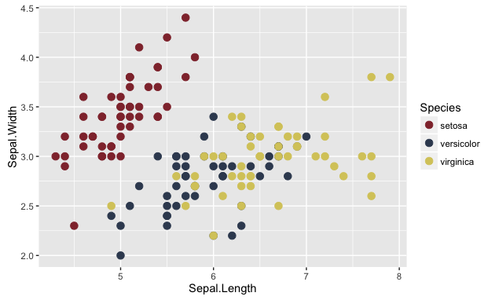
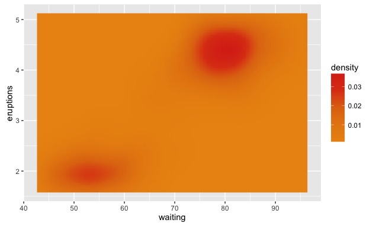

# RColorLisa
Easily load color palettes from great painters into R. Based on the work of Ryan McGuire who created the beautiful site [Color Lisa](http://colorlisa.com).

## Installation
```R
devtools::install_github("vikjam/RColorLisa")
```

## Usage

### Examples
```R
# Create a sequential palette for usage and show colors
library(RColorLisa)
pretty.palette <- color.lisa.pal(5, "The Dream by Pablo Picasso")
image(1:5, 1, as.matrix(1:5), col = pretty.palette, xlab = "The Dream by Pablo Picasso",
      ylab = "", xaxt = "n", yaxt = "n", bty = "n")
```


```R
# ggplot2 example
library(ggplot2)
library(RColorLisa)
df <- data.frame(x = rep(c(2, 5, 7, 9, 12), 2),
                 y = rep(c(1, 2), each = 5),
                 z = factor(rep(1:5, each = 2))
)
escher.pal <- color.lisa.pal(5, "Gravity by M.C. Escher")
ggplot(df, aes(x, y)) + geom_tile(aes(fill = z)) +
                        scale_fill_manual(values = escher.pal)
```


```R
# Slightly more practical ggplot2 example
library(ggplot2)
library(RColorLisa)
ernst.pal <- color.lisa.pal(3, "Woman, Old Man, and Flower by Max Ernst")
ggplot(iris, aes(Sepal.Length, Sepal.Width, color = Species)) + 
       geom_point(size = 3) + 
       scale_color_manual(values = ernst.pal)
```


```R
# A gradient
library(ggplot2)
library(RColorLisa)
rothko.pal  <- color.lisa.pal(5, "Untitled (Orange, Yellow, Red) by Mark Rothko")
ggplot(faithfuld, aes(waiting, eruptions)) +
       geom_raster(aes(fill = density), interpolate = TRUE) +
       scale_fill_gradientn(colours = rothko.pal)
```

